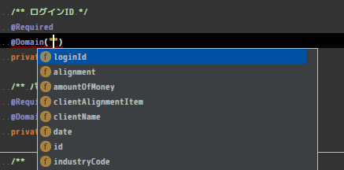
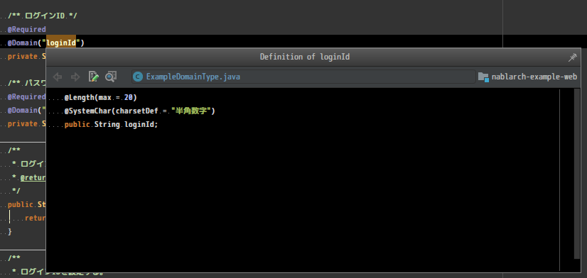
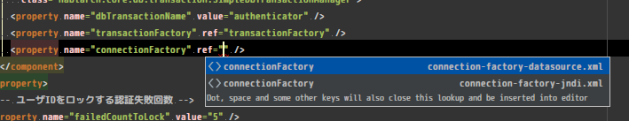

Nablarch( https://github.com/nablarch ) の開発を少しサポートするIntelliJ IDEA用のプラグイン

# Bean Validationサポート
ドメインバリデーション使用時に、ドメイン名を補完することができます。

下の画像のように、Domainアノテーションのvalue属性の文字列内で、
ドメイン名を候補から選択することができます。

Quick Definitionを使うことでドメインの定義を参照することが出来ます。

# リポジトリXMLのサポート
コンポーネント定義時のref属性に設定可能なコンポーネント一覧をリスト表示できます。

